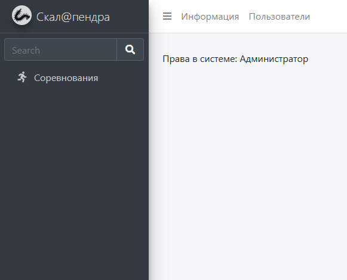
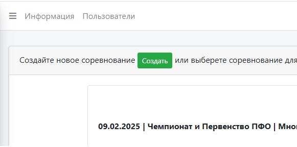
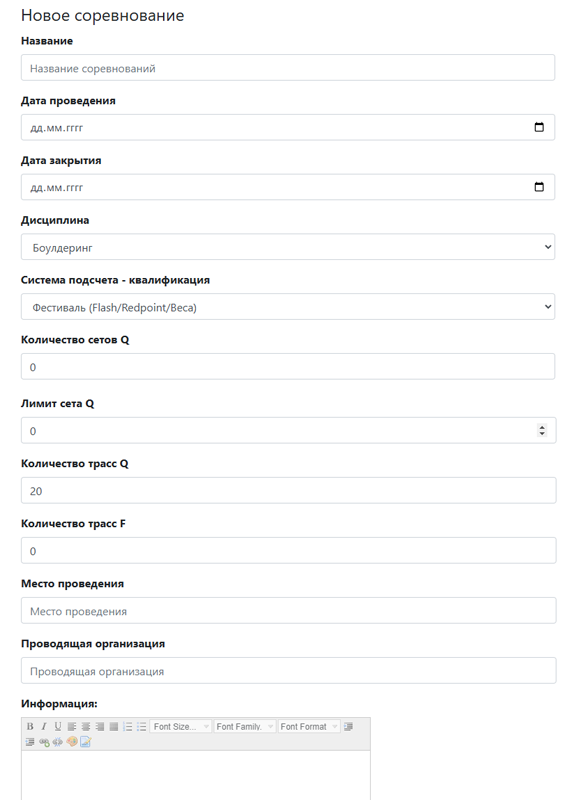

# Создание соревнования

Выберете в меню пункт "Соревнования".

Нажмите кнопку "Создать", для добавления соревнования.

Откроется форма создания соревнования.

## Описание полей

* "Название" - Наименование соревнований, отображается в календаре при
регистрации и в протоколах;
* "Дата проведения" - Дата первого дня соревнований,отображается в календаре при
  регистрации и в протоколах; 
* "Дата закрытия" - Дата первого дня соревнований, пока нигде не используется;
* "Дисциплина" - Дисциплина в которой проводятся соревнования:

>Выбор: Боулдеринг, Трудность, Скорость, Многоборье (только создания регистрации).

>При выборе скорости появляются поля выбора эталон и класика. Можно выбрать обе дисциплины
>в одном соревновании, но лучше создать новое соревнование для каждой дисциплины.

* "Система подсчета - квалификация" - Как считать квалификацию:
- Фестиваль (T/B/Баллы)
- Фестиваль (Flash/Redpoint/Веса)
- Соревнования трудность
- Соревнования болдеринг (T/Z/Попытки)
- Соревнования Скорость 
- Фестиваль (Flash/Redpoint/Веса/К-во оттяжек).

* "Количество cетов Q" - Влияет на регистрацию: 0 - один список, n - Нужное количество сетов.
* "Лимит cета Q" - устанавливает ограничение на количество учасников в каждом сете регистрации.
* "Количество трасс Q" - Для системы подсчета "Соревнования трудность" всегда ставим 2, 
для Дисциплины "Трудность" и системы подсчета "Фестиваль" - необходимое количество трасс,
"Соревнования Скорость" - 2, для боулдеринга необходимое количество трасс.
* "Количество трасс F" - Для трудности всегда ставим 1, для скорости - 2, для боулдеринга
    необходимое количество трасс.
* "Место проведения" - Место проведения указываем например: г. Пенза, АНО "АльпТур", отображается
в протоколе.
* "Проводящая организация" - Проводящая организация указываем например: РОО "ФСПО", отображается 
* в протоколе. 

## Лазание на трудность

## Боулдеринг

## Лазание на скорость классический формат

## Лазание на скорость эталонный формат
