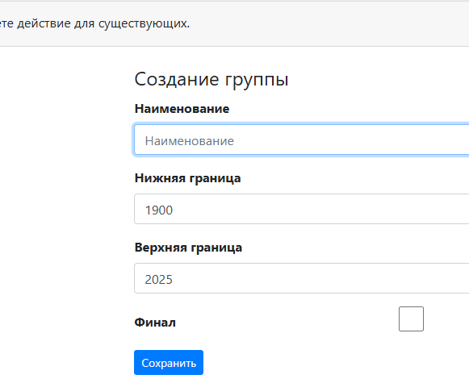

# Создание групп

Группы в системе задаются диапазоном годов рождения сортсменов.

Для создания групп выбираем пункт меню "Группы" на верхней навигационной панели.

## Описание полей

* Наименование - название группы. Например: ЮД 10-13 лет.
* Нижняя граница - минимальный год рождения спортсмена для данной группы.
Например: Для 2025 года в группе ЮД 10-13 лет 2025г-13лет = 2012г.
* Верхняя граница - максимальный год рождения спортсмена для данной группы.
Например: Для 2025 года в группе ЮД 10-13 лет 2025г-10лет = 2015г.
* Финал - есть ли финальный раунд для группы.

!!! warning "Внимание"
    На данный момент необходимо устанавливать галку в поле "Финал" для всех групп, независимо
    от наличия финального раунда для данной группы.
