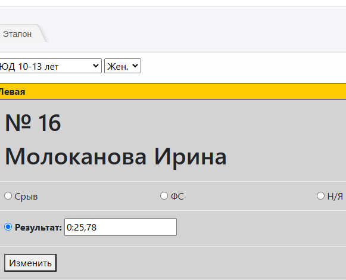

# Внесение результатов Скорость "Эталон"

## Внесение результатов Скорость "Эталон" квалификация

Внесение результатов участников в автоматизированную систему. Пункт меню "Ввод рез. Q".
    
* Выбираем группу и пол

Отображается список спортсменов (попарно) на трассах согласно жеребьевке

Возможные варианты результата:

* Срыв - спортсмен сорвался или не остановлено время хронометра;
* ФС - фальстарт;
* Н/Я - неявка;
* Результат - вносим время в формате м:cc:ms

Для сохранения нажимаем кнопку сохранить. Спортсмен, у которого внесен результат
перемещается в конец списка.

!!! note "Важно"
    Результат вносится каждому спортсмену отдельно.

## Внесение результатов Скорость "Эталон" финальная часть

Выбираем группу, пол и текущий раунд

Отображается список спортсменов (попарно) на трассах согласно схеме раунда

Возможные варианты результата:

* Срыв - спортсмен сорвался или не остановлено время хронометра;
* ФС - фальстарт;
* Авто - победа без забега
* Н/Я - неявка;
* Результат - вносим время в формате м:cc:ms

Для сохранения нажимаем кнопку сохранить. Пара в которой, у обоих спортсменов внесен результат
перемещается в конец списка.

!!! warning "Внимание"
    Результат вносится каждому спортсмену отдельно. При Ф/С на другой трассе проставляем
    Авто вручную.